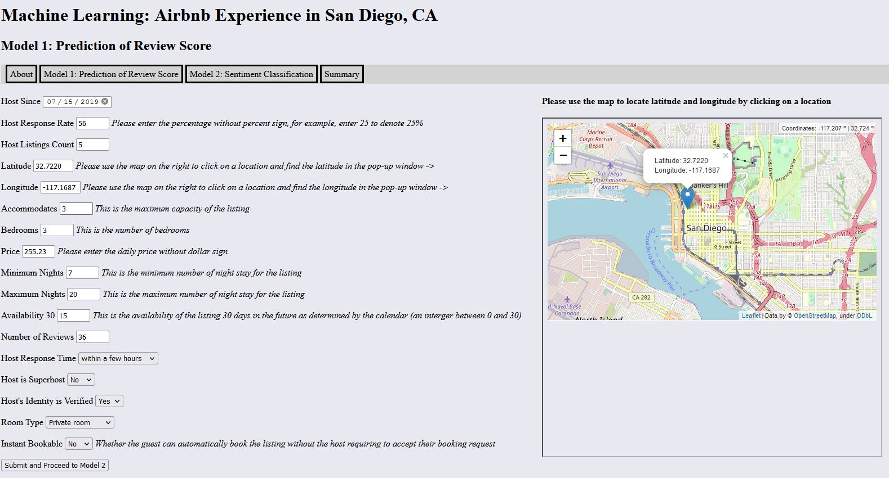
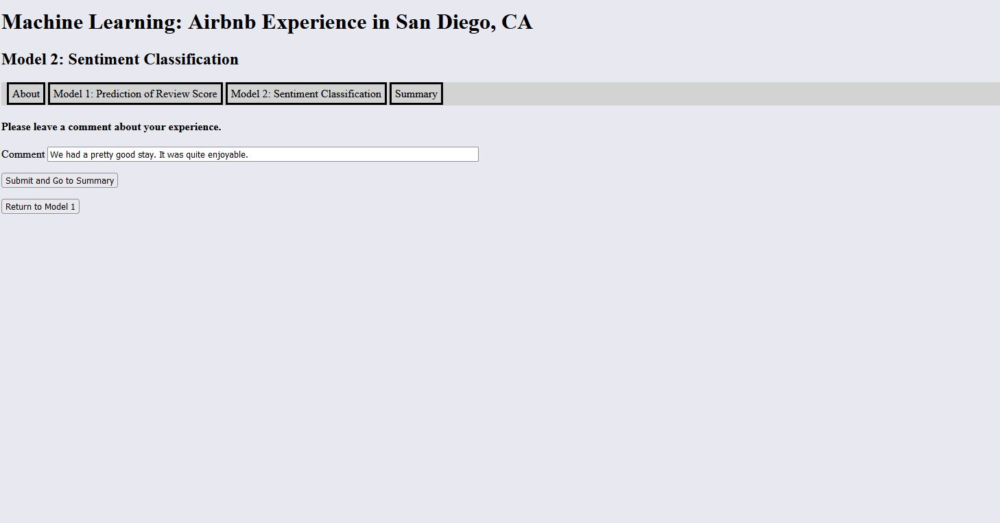
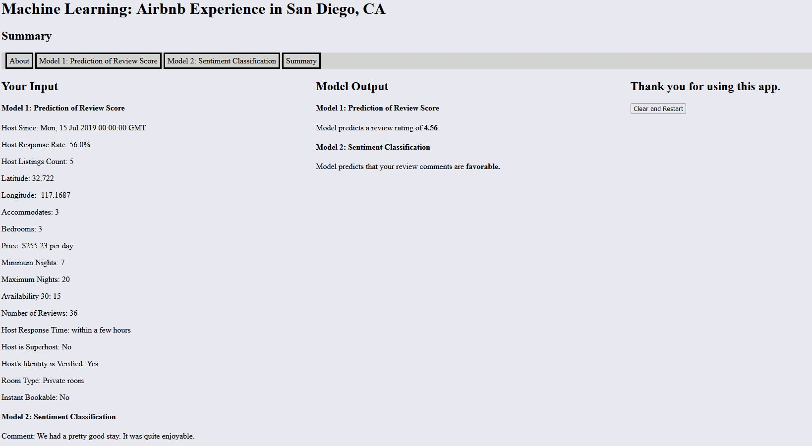

# Airbnb Experience Flask Web App

**Summary**
---
In this project, I attempt to build a Flask web app to demonstrate the use of (1) a Ridge regression to predict the review rating of the Airbnb experience and (2) a neural network to classify the sentiment of the reviewer’s written comment about the Airbnb experience. The model output is reflective of San Diego, CA because the training data used in building the models is Airbnb’s public data on the San Diego region.
The goal of the project is to push machine learning models to production. I use the Flask framework to create a web app that lets the user input all required fields and see model output immediately after.

**Flask App Deployed to Heroku**
---
Please check out the app at https://airbnb-experience-ml.herokuapp.com/

* Here are some screenshots

**Model 1: Predicting Review Score**
---

*Objective*

Airbnb’s actual review ratings have been traditionally positive on a scale of 0 to 5. The overwhelming majority of the ratings (at least 85%) are 4 or above. Any score that’s 4 or more is considered a good score and implies a positive experience. However, one can ask “how positive is the positive rating?” Scores between 4 and 5 have essential become a new scale in which customers are rating how good the experience really is. It may be very good or just somewhat good. Thus, the goal of Model 1 attempts to predict review ratings on a continuous scale. Model 2 serves as a complement to Model 1 because sentiment analysis goes beyond a rating score and provides the context in which the rating score is justified.

[Model_1.ipynb](https://github.com/RonaldLi-GitHub/Airbnb_Experience_Flask_Web_App/blob/main/Model_1.ipynb) contains the code for Model 1. The output is [ridge_model.pkl](https://github.com/RonaldLi-GitHub/Airbnb_Experience_Flask_Web_App/blob/main/ridge_model.pkl).

*Data Preparation*
*	Data is from Airbnb’s official data repository at http://insideairbnb.com/get-the-data.html. The data focuses on San Diego, CA and was compiled on 9/25/2021
*	The outcome variable of interest is review rating, which is on a numerical value of 0 to 5. Decimals are allowed.
*	The reason Model 1 is a regression problem rather than a classification problem is that the vast majority of the scores fall between 4 and 5. A multinomial problem would place the scale on a discrete meter and only look at discrete scores of 0 to 5. The distribution of such discrete scores would not allow the model to yield meaningful output. Therefore, the model focuses on review ratings on a continuous scale
*	Identification variables are dropped from the model
*	Variables that have percentage signs are converted to float
*	Explanatory variables are divided into numerical and categorical
*	Records with null values in any of the selected explanatory variables are removed
*	Pairplot is plotted for all numerical variables and the outcome variable
*	Boxplot is plotted for all categorical variables and the outcome variable
*	Variable inflation factor is computed in order to detect multicollinearity

*Modeling*
*	The data is split into 70% training and 30% testing
*	Linear regression is the first model attempted
*	A root mean squared error is 0.348 is reported on the testing data
*	Ridge regression is the second model attempted. I perform a grid search to find the optimal parameters
*	A root mean squared error of 0.347 is reported on the testing data using ridge regression
*	Ridge regression slightly outperforms linear regression and thus is chosen as the final model

**Model 2: Sentiment Classification**
---

*Objective*

As a complement to Model 1, Model 2 attempts to classify the Airbnb experience as favorable or unfavorable by analyzing the sentiment of the user’s review comment.

[Model_2.ipynb](https://github.com/RonaldLi-GitHub/Airbnb_Experience_Flask_Web_App/blob/main/Model_2.ipynb) contains the code for Model 2. The output files are [tf_model.h5](https://github.com/RonaldLi-GitHub/Airbnb_Experience_Flask_Web_App/blob/main/tf_model.h5) and [tokenizer.pickle](https://github.com/RonaldLi-GitHub/Airbnb_Experience_Flask_Web_App/blob/main/tokenizer.pickle).

*Data Preparation*
*	Data is from Sentiment140’s official repository at http://help.sentiment140.com/for-students/. 
*	The dataset contains roughly 1.6 million tweets and the associated sentiments (positive or negative)
*	Tweet text contains the text for this dataset. First, I remove characters such as @, http, extra spaces
*	All text are converted to lower case
*	Stop words are those that don't have particular meanings and don't alter the semantics of the sentences. Thus, such words will be removed

*Modeling*
*	The data is split into 70% training and 30% testing
*	A tokenizer is created using the top 50,000 most common words
*	I set up the neural network. Bidirectional LSTM is particularly useful when the order of words has an impact on the overall tone of the sentences. Drop out layer also helps in reducing overfitting
*	After 3 epochs, the model reaches 82% accuracy on the testing data. Further epochs will see a drop on validation accuracy. Thus the model finishes training after 3 epochs

**Flask App Development**
---

I use the Flask framework to deploy Model 1 and Model 2 to the web.

* [app.py](https://github.com/RonaldLi-GitHub/Airbnb_Experience_Flask_Web_App/blob/main/app.py) refers to the logic that connects user input to model output. The code details how the app takes user input, runs Model 1 and Model 2 and displays the final result
* [forms.py](https://github.com/RonaldLi-GitHub/Airbnb_Experience_Flask_Web_App/blob/main/forms.py) refers to the Flask forms. Validation is enforced to many of the user input fields to ensure that the input numbers/dates are reasonable.
* [map.py](https://github.com/RonaldLi-GitHub/Airbnb_Experience_Flask_Web_App/blob/main/map.py) refers to the folium map used in the app that allows the user to select longitude and latitude
* [templates](https://github.com/RonaldLi-GitHub/Airbnb_Experience_Flask_Web_App/tree/main/templates) contains the HTML files 
* [static](https://github.com/RonaldLi-GitHub/Airbnb_Experience_Flask_Web_App/tree/main/static) contains the CSS file

